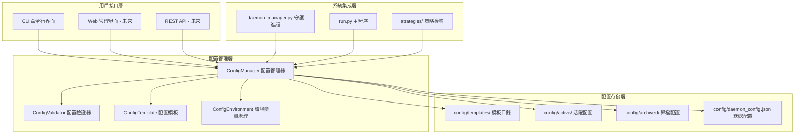
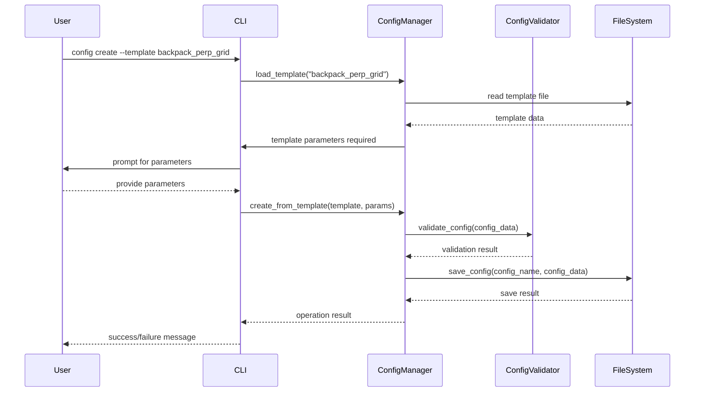
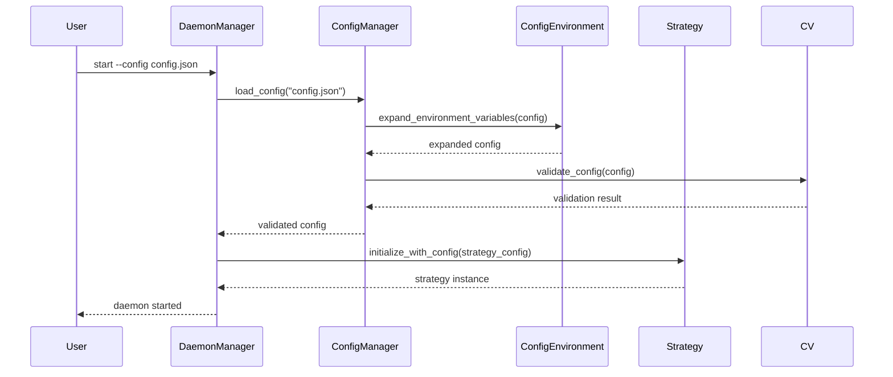

# 多配置管理系統架構文檔

## 系統概覽

多配置管理系統是 Backpack-MM-Simple 項目的配置管理升級方案，旨在提供靈活、可擴展的配置管理能力，支持多交易所、多交易對、多策略的獨立配置管理。

## 架構設計

### 整體架構圖



### 核心組件設計

#### 1. ConfigManager (配置管理器)

**職責**:
- 配置文件的讀寫操作
- 配置列表和篩選
- 配置備份和恢復
- 配置版本管理

**核心方法**:
```python
class ConfigManager:
    def __init__(self, config_dir: str = "config")
    def list_configs(self, filters: Dict = None) -> List[ConfigInfo]
    def load_config(self, config_name: str) -> Dict
    def save_config(self, config_name: str, config_data: Dict) -> bool
    def create_from_template(self, template: str, params: Dict) -> Dict
    def validate_config(self, config_data: Dict) -> ValidationResult
    def delete_config(self, config_name: str) -> bool
    def backup_config(self, config_name: str) -> str
    def restore_config(self, backup_path: str) -> bool
```

#### 2. ConfigValidator (配置驗證器)

**職責**:
- 配置參數類型驗證
- 參數範圍檢查
- 交易所兼容性驗證
- 策略參數依賴檢查

**驗證規則**:
```python
validation_rules = {
    "metadata": {
        "required": ["name", "exchange", "symbol", "market_type", "strategy"],
        "validators": {
            "exchange": ["backpack", "aster", "paradex", "lighter"],
            "market_type": ["spot", "perp"],
            "strategy": ["standard", "grid", "perp_grid", "maker_hedge"]
        }
    },
    "strategy_config": {
        "grid_strategy": {
            "grid_upper_price": {"type": "float", "min": 0},
            "grid_lower_price": {"type": "float", "min": 0},
            "grid_num": {"type": "int", "min": 2, "max": 200},
            "grid_mode": {"type": "string", "enum": ["arithmetic", "geometric"]},
            "grid_type": {"type": "string", "enum": ["neutral", "long", "short"]}
        }
    }
}
```

#### 3. ConfigTemplate (配置模板)

**職責**:
- 提供預定義配置模板
- 支持模板參數化
- 模板繼承和組合

**模板結構**:
```python
class ConfigTemplate:
    def __init__(self, template_path: str)
    def load_template(self) -> Dict
    def render(self, params: Dict) -> Dict
    def validate_params(self, params: Dict) -> bool
    def get_required_params(self) -> List[str]
```

## 數據流設計

### 配置創建流程



### 配置使用流程



## 配置文件格式標準

### 基礎結構

```json
{
  "metadata": {
    "name": "配置顯示名稱",
    "description": "配置詳細描述",
    "exchange": "backpack|aster|paradex|lighter",
    "symbol": "交易對符號",
    "market_type": "spot|perp",
    "strategy": "standard|grid|perp_grid|maker_hedge",
    "created_at": "2025-11-26T16:00:00Z",
    "updated_at": "2025-11-26T16:00:00Z",
    "version": "1.0.0",
    "author": "用戶名",
    "tags": ["標籤1", "標籤2"]
  },
  "daemon_config": {
    "python_path": ".venv/bin/python3",
    "script_path": "run.py",
    "working_dir": ".",
    "log_dir": "logs",
    "max_restart_attempts": 3,
    "restart_delay": 60,
    "health_check_interval": 30,
    "memory_limit_mb": 2048,
    "cpu_limit_percent": 80,
    "auto_restart": true,
    "log_cleanup_interval": 86400,
    "log_retention_days": 2
  },
  "exchange_config": {
    "api_key": "${EXCHANGE_API_KEY}",
    "secret_key": "${EXCHANGE_SECRET_KEY}",
    "base_url": "交易所API端點",
    "timeout": 30,
    "retry_count": 3
  },
  "strategy_config": {
    "策略特定參數": "根據策略類型變化"
  }
}
```

### 環境變量支持

支持 `${VARIABLE_NAME}` 格式的環境變量替換：

```json
{
  "exchange_config": {
    "api_key": "${BACKPACK_KEY}",
    "secret_key": "${BACKPACK_SECRET}",
    "base_url": "${BACKPACK_URL:-https://api.backpack.exchange}"
  }
}
```

支持默認值語法：`${VARIABLE:-default_value}`

## 擴展性設計

### 1. 插件化策略支持

```python
class StrategyPlugin:
    def __init__(self, name: str, version: str)
    def get_config_schema(self) -> Dict
    def validate_config(self, config: Dict) -> ValidationResult
    def create_strategy(self, config: Dict) -> StrategyBase
```

### 2. 多交易所擴展

```python
class ExchangeAdapter:
    def __init__(self, exchange_name: str)
    def get_config_schema(self) -> Dict
    def validate_config(self, config: Dict) -> ValidationResult
    def create_client(self, config: Dict) -> ExchangeClient
```

### 3. 配置繼承機制

```json
{
  "extends": "base_config.json",
  "metadata": {
    "name": "繼承配置"
  },
  "strategy_config": {
    "max_position": 2.0  // 覆蓋基礎配置
  }
}
```

## 安全性設計

### 1. API 密鑰保護

- 強制使用環境變量存儲敏感信息
- 配置文件中禁止直接存儲 API 密鑰
- 配置驗證時檢查敏感信息洩露

### 2. 配置文件權限

```bash
# 設置適當的文件權限
chmod 600 config/active/*.json
chmod 700 config/
```

### 3. 配置備份加密

```python
class ConfigBackup:
    def encrypt_backup(self, config_data: Dict, password: str) -> bytes
    def decrypt_backup(self, encrypted_data: bytes, password: str) -> Dict
```

## 性能考慮

### 1. 配置緩存

```python
class ConfigCache:
    def __init__(self, cache_size: int = 100)
    def get_config(self, config_name: str) -> Optional[Dict]
    def set_config(self, config_name: str, config_data: Dict) -> None
    def invalidate(self, config_name: str) -> None
```

### 2. 延遲加載

- 只在需要時加載配置文件
- 配置列表使用元數據，不加載完整配置
- 大配置文件的流式處理

### 3. 並發安全

```python
import threading

class ThreadSafeConfigManager:
    def __init__(self):
        self._lock = threading.RLock()
        self._cache = {}
    
    def load_config(self, config_name: str) -> Dict:
        with self._lock:
            # 線程安全的配置加載
            pass
```

## 監控和日誌

### 1. 配置操作日誌

```python
class ConfigAuditLogger:
    def log_config_access(self, config_name: str, user: str, action: str)
    def log_config_change(self, config_name: str, changes: Dict)
    def log_validation_error(self, config_name: str, errors: List[str])
```

### 2. 性能監控

```python
class ConfigMetrics:
    def record_load_time(self, config_name: str, duration: float)
    def record_validation_time(self, config_name: str, duration: float)
    def get_performance_stats(self) -> Dict
```

## 測試策略

### 1. 單元測試

```python
class TestConfigManager:
    def test_load_config(self)
    def test_save_config(self)
    def test_validate_config(self)
    def test_environment_expansion(self)
```

### 2. 集成測試

```python
class TestConfigIntegration:
    def test_daemon_config_loading(self)
    def test_strategy_config_parsing(self)
    def test_multi_config_switching(self)
```

### 3. 端到端測試

```python
class TestE2EConfig:
    def test_config_creation_to_trading(self)
    def test_config_backup_restore(self)
    def test_error_handling(self)
```

## 部署和遷移

### 1. 向後兼容性

- 保持現有 `daemon_config.json` 支持
- 自動檢測和升級舊配置格式
- 提供配置遷移工具

### 2. 漸進式遷移

```bash
# 第一步：備份現有配置
cp config/daemon_config.json config/daemon_config.json.backup

# 第二步：創建新格式配置
python cli/commands.py --config migrate --from daemon_config.json

# 第三步：驗證遷移結果
python cli/commands.py --config validate new_config.json
```

### 3. 回滾策略

```bash
# 如果新系統有問題，快速回滾
python core/daemon_manager.py start --config config/daemon_config.json.backup
```

## 未來發展

### 1. Web 管理界面

- 基於 Web 的配置管理界面
- 實時配置監控
- 圖形化配置編輯器

### 2. 配置分享市場

- 社區配置模板分享
- 配置評分和評論系統
- 一鍵導入優秀配置

### 3. 智能配置推薦

- 基於歷史表現的配置優化
- 市場條件自動配置調整
- AI 驅動的參數推薦

### 4. 雲端配置同步

- 多設備配置同步
- 雲端備份和恢復
- 團隊配置共享

---

本架構文檔將隨系統發展持續更新，確保與實際實現保持同步。