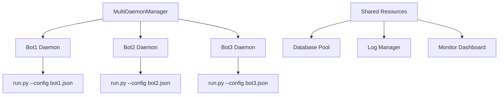

# 多個 Perp Grid Bot 同時運行可行性分析

## 日期
2025-11-27

## 分析概述
根據當前 codebase 分析運行多個不同的 perp grid bot 同時執行的可行性和難度評估。

## 現狀分析

### 1. 當前架構限制
您的 [`daemon_manager.py`](core/daemon_manager.py:1) 目前的設計是**單一實例**模式：
- 一個 daemon 进程管理一個 [`run.py`](run.py:1) 进程
- [`daemon_config.json`](config/daemon_config.json:1) 只能配置單一策略
- 進程管理使用單一 PID 文件追蹤

### 2. 配置系統
您已經有良好的配置基礎：
- 支持多配置格式（[`_is_multi_config_format()`](core/daemon_manager.py:56)）
- 有模板系統（[`config/templates/`](config/templates/:1)）
- 配置驗證機制（[`ConfigManager`](core/config_manager.py:1)）

## 執行難度評估

### 🔴 高難度點

1. **進程隔離與管理**
   - 需要為每個 bot 創建獨立的 daemon 进程
   - PID 文件衝突問題
   - 資源競爭（CPU、記憶體、網路）

2. **配置衝突**
   - WebSocket 連接數量限制
   - API 速率限制共享
   - 日誌文件路徑衝突

3. **資料庫競爭**
   - 多個策略同時寫入同一個資料庫
   - 持倉資料一致性問題

### 🟡 中等難度點

1. **監控與狀態管理**
   - 需要統一的狀態查看介面
   - 個別 bot 的啟動/停止控制

2. **錯誤處理**
   - 一個 bot 失敗不應影響其他 bot
   - 獨立的錯誤恢復機制

### 🟢 低難度點

1. **配置複用**
   - 您的模板系統已經很完善
   - 環境變數支援良好

## 解決方案架構

### 1. 多進程管理器設計



### 2. 建議的實施步驟

1. **創建 MultiDaemonManager**
   - 管理多個 daemon 进程
   - 為每個 bot 分配唯一 ID
   - 獨立的 PID 文件管理

2. **配置系統改造**
   - 支援 bot 實例配置
   - 動態配置載入
   - 資源限制配置

3. **資源隔離**
   - 獨立的日誌路徑
   - 資料庫連接池
   - API 速率限制分配

## 技術實現建議

### 1. 進程管理改造
```python
# 新增 core/multi_daemon_manager.py
class MultiDaemonManager:
    def __init__(self):
        self.bots = {}  # {bot_id: TradingBotDaemon}
        self.config_dir = Path("config/active")
        
    def start_bot(self, bot_id: str, config_file: str):
        # 為每個 bot 創建獨立的 daemon
        pass
        
    def stop_bot(self, bot_id: str):
        # 停止特定 bot
        pass
        
    def list_bots(self):
        # 列出所有運行的 bot
        pass
```

### 2. 配置結構調整
```json
{
  "bot_id": "eth_perp_grid_1",
  "instance_config": {
    "pid_file": "logs/bots/eth_perp_grid_1.pid",
    "log_dir": "logs/bots/eth_perp_grid_1",
    "port": 5001
  },
  "daemon_config": { ... },
  "exchange_config": { ... },
  "strategy_config": { ... }
}
```

### 3. 資源共享策略
- **資料庫**: 使用連接池，每個 bot 獨立的資料表
- **API 限制**: 全局速率限制管理器
- **監控**: 統一的 Web Dashboard

## 風險評估

### 高風險
- **API 限制超標**: 多個 bot 可能觸發交易所速率限制
- **持倉衝突**: 同一交易對的多個策略可能相互干擾

### 中風險
- **資源耗盡**: 記憶體和 CPU 使用量線性增長
- **複雜性增加**: 故障排除變得困難

### 緩解策略
1. **實施資源配額**
2. **強制性的交易對隔離**
3. **完善的監控和警報系統**

## 結論

執行難度：**中等到偏高**

雖然您的 codebase 有良好的基礎，但需要進行相當多的架構調整。建議：

1. **先實施最小可行性版本**（2-3 個 bot）
2. **逐步增加功能**（監控、管理介面）
3. **充分測試資源隔離**
4. **建立完善的監控系統**

這樣的功能擴展是可行的，但需要謹慎的規劃和實施。

## 參考文件
- [`core/daemon_manager.py`](core/daemon_manager.py:1) - 當前單一實例 daemon 管理器
- [`config/daemon_config.json`](config/daemon_config.json:1) - 單一策略配置範例
- [`config/templates/backpack_perp_grid.json`](config/templates/backpack_perp_grid.json:1) - 永續網格策略模板
- [`strategies/perp_grid_strategy.py`](strategies/perp_grid_strategy.py:1) - 永續網格策略實現