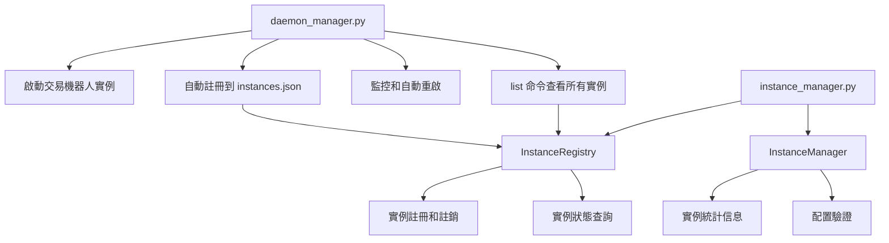

# 多實例交易機器人啟動方法指南

## 📋 文檔信息

- **日期**：2025-11-30
- **版本**：1.1
- **目標**：說明 Backpack-MM-Simple 系統中的實例啟動和管理方法
- **最後審查**：2025-11-30

---

## 🔧 守護進程管理方法

### `core/daemon_manager.py` - 守護進程管理器

**用途：啟動和管理交易機器人實例**

- **功能**：啟動、停止、重啟、監控單個交易機器人實例
- **特點**：
  - 每個實例作為獨立的守護進程運行
  - 自動重啟機制（進程崩潰時自動重啟）
  - 資源監控和健康檢查
  - SSH 斷開後繼續運行
  - 自動註冊到實例註冊表

**使用方式**：
```bash
# 啟動特定配置的實例
.venv/bin/python3 core/daemon_manager.py start --config config/active/bp_sol_01.json --daemon

# 停止特定實例
.venv/bin/python3 core/daemon_manager.py stop --config config/active/bp_sol_01.json

# 重啟特定實例
.venv/bin/python3 core/daemon_manager.py restart --config config/active/bp_eth_02.json

# 查看特定實例狀態
.venv/bin/python3 core/daemon_manager.py status --config config/active/bp_sol_01.json

# 列出所有實例
.venv/bin/python3 core/daemon_manager.py list
```

**核心方法**：
- `start(daemonize=True)` - 啟動守護進程
- `stop()` - 停止守護進程
- `restart()` - 重啟守護進程
- `status()` - 獲取進程狀態
- `list_instances()` - 列出所有運行中的實例（命令行：`daemon_manager.py list`）

**實例註冊機制**：
- 使用 `core/instance_manager.py` 中的 `InstanceRegistry` 類
- 自動註冊到 `logs/instances.json`
- 提供實例查詢、狀態檢查、清理等功能

---

## 📋 實際工作流程

### 啟動多個實例的完整流程：

1. **使用 daemon_manager 啟動各個實例**：
```bash
# 啟動 SOL 網格實例（端口 5001）
.venv/bin/python3 core/daemon_manager.py start --config config/active/bp_sol_01.json --daemon

# 啟動 ETH 網格實例（端口 5002）
.venv/bin/python3 core/daemon_manager.py start --config config/active/bp_eth_02.json --daemon

# 啟動第三個實例
.venv/bin/python3 core/daemon_manager.py start --config config/active/backpack_eth_usdc_perp_grid.json --daemon
```

2. **查看所有運行中的實例**：
```bash
# 列出所有實例
.venv/bin/python3 core/daemon_manager.py list
```

3. **管理特定實例**：
```bash
# 停止特定實例
.venv/bin/python3 core/daemon_manager.py stop --config config/active/bp_sol_01.json

# 重啟特定實例
.venv/bin/python3 core/daemon_manager.py restart --config config/active/bp_eth_02.json

# 查看特定實例狀態
.venv/bin/python3 core/daemon_manager.py status --config config/active/bp_sol_01.json
```

---

## 🔄 系統架構圖



---

## 💡 核心組件說明

| 組件 | 文件路徑 | 主要功能 |
|------|---------|---------|
| **守護進程管理器** | `core/daemon_manager.py` | 啟動、停止、重啟、監控單個實例；提供 list 命令查看所有實例 |
| **實例註冊表** | `core/instance_manager.py` (InstanceRegistry) | 管理實例註冊信息（存儲在 `logs/instances.json`） |
| **實例管理器** | `core/instance_manager.py` (InstanceManager) | 提供實例統計、配置驗證等高級功能 |
| **配置管理器** | `core/config_manager.py` | 配置文件加載、驗證、環境變量展開 |

---

## 🔧 實例隔離機制

### 資源隔離
每個實例擁有獨立的資源：

| 資源類型 | 隔離路徑 | 配置方式 |
|---------|---------|---------|
| 守護進程 PID | `logs/{instance_id}/daemon.pid` | 自動生成 |
| Bot 進程 PID | `logs/{instance_id}/bot.pid` | 自動生成 |
| 日誌目錄 | `logs/{instance_id}/YYYY-MM-DD/` | daemon_config.log_dir |
| 數據庫文件 | `database/{instance_id}.db` | daemon_config.db_path |
| Web 端口 | 5001, 5002, 5003... | daemon_config.web_port |

### 配置文件範例
```json
{
  "metadata": {
    "instance_id": "bp_sol_01",
    "exchange": "backpack",
    "symbol": "SOL_USDC_PERP",
    "strategy": "perp_grid"
  },
  "daemon_config": {
    "log_dir": "logs/bp_sol_01",
    "db_path": "database/bp_sol_01.db",
    "web_port": 5001
  }
}
```

---

## 🎯 最佳實踐

### 1. 實例命名規範
```
<exchange>_<symbol>_<number>
例如：
- bp_sol_01  (Backpack SOL 實例 1)
- bp_eth_02  (Backpack ETH 實例 2)
- aster_btc_01 (Aster BTC 實例 1)
```

### 2. 啟動順序建議
1. 先啟動第一個實例，確認運行正常
2. 再啟動其他實例
3. 使用 `daemon_manager.py list` 確認所有實例狀態

### 3. 監控建議
```bash
# 定期檢查所有實例狀態
watch -n 30 ".venv/bin/python3 core/daemon_manager.py list"

# 查看特定實例的詳細狀態
.venv/bin/python3 core/daemon_manager.py status --config config/active/bp_sol_01.json
```

### 4. 故障排查
```bash
# 查看實例日誌
tail -f logs/bp_sol_01/$(date +%Y-%m-%d)/bot_stdout.log
tail -f logs/bp_sol_01/$(date +%Y-%m-%d)/bot_stderr.log

# 查看守護進程日誌
tail -f logs/bp_sol_01/$(date +%Y-%m-%d)/daemon.log

# 查看實例詳細狀態
.venv/bin/python3 core/daemon_manager.py status --config config/active/bp_sol_01.json

# 檢查實例是否在運行
ps aux | grep "run.py"
```

---

## 📊 實例狀態輸出示例

### daemon_manager.py list 輸出
```
實例ID                 PID        Web端口      配置文件                                     啟動時間
--------------------------------------------------------------------------------------------------------------------
🟢 bp_sol_01          12345      5001       config/active/bp_sol_01.json             2025-11-30 19:00:00
🟢 bp_eth_02          12346      5002       config/active/bp_eth_02.json             2025-11-30 19:01:00
```

### daemon_manager.py status 輸出
```json
{
  "running": true,
  "timestamp": "2025-11-30T19:30:00.000000",
  "pid": 12345,
  "process_info": {
    "name": "python3",
    "cmdline": ["python3", "core/daemon_manager.py", "start", ...],
    "create_time": "2025-11-30T19:00:00.000000",
    "cpu_percent": 2.5,
    "memory_info": {
      "rss": 152371200,
      "vms": 512345600,
      "rss_mb": 145.3
    },
    "status": "running",
    "num_threads": 8
  },
  "config": {
    "python_path": ".venv/bin/python3",
    "log_dir": "logs/bp_sol_01",
    "web_port": 5001,
    ...
  }
}
```

---

## ❓ 常見問題

### Q1: 如何查看所有運行中的實例？
A: 使用以下命令：
```bash
.venv/bin/python3 core/daemon_manager.py list
```
這會顯示所有已註冊的實例及其狀態。

### Q2: 如何查看特定實例的詳細信息？
A: 使用 status 命令：
```bash
.venv/bin/python3 core/daemon_manager.py status --config config/active/bp_sol_01.json
```
這會返回 JSON 格式的詳細狀態信息，包括 CPU、內存使用等。

### Q3: 實例註冊信息存儲在哪裡？
A: 實例信息自動註冊到 `logs/instances.json` 文件中，由 `InstanceRegistry` 類管理。

### Q4: 如何清理已停止的實例記錄？
A: `InstanceRegistry` 提供了 `cleanup_dead_instances()` 方法。可以通過 Python 腳本調用：
```python
from core.instance_manager import InstanceRegistry
registry = InstanceRegistry()
count = registry.cleanup_dead_instances()
print(f"清理了 {count} 個已停止的實例記錄")
```

### Q5: daemon_manager.py 的 list 命令和 InstanceRegistry 有什麼關係？
A: `daemon_manager.py list` 命令內部調用 `InstanceRegistry` 來讀取 `logs/instances.json` 並顯示所有註冊的實例。

---

## 📚 相關文檔

- [多實例實施指南](../sessions/multi_instance_implementation_guide.md) - 詳細的技術實施文檔
- [系統管理文檔](../../../docs/system/Fork_README.md) - 系統概述和使用指南
- [配置管理指南](../../../docs/config_management.md) - 配置文件結構和管理

---

## 🔍 技術細節

### InstanceRegistry 核心方法
```python
# 註冊實例
registry.register(instance_id, info_dict)

# 註銷實例
registry.unregister(instance_id)

# 獲取實例信息
info = registry.get(instance_id)

# 列出所有實例
instances = registry.list_instances(include_dead=False)

# 清理已停止的實例
count = registry.cleanup_dead_instances()
```

### 實例信息結構
存儲在 `logs/instances.json` 中的每個實例信息包含：
```json
{
  "instance_id": {
    "config_file": "config/active/bp_sol_01.json",
    "pid": 12345,
    "log_dir": "logs/bp_sol_01",
    "web_port": 5001,
    "started_at": "2025-11-30T19:00:00",
    "status": "running",
    "registered_at": "2025-11-30T19:00:00",
    "last_updated": "2025-11-30T19:30:00"
  }
}
```

---

**文檔版本**：1.1  
**作者**：Kilo Code  
**最後更新**：2025-11-30  
**審閱狀態**：已審查並修正